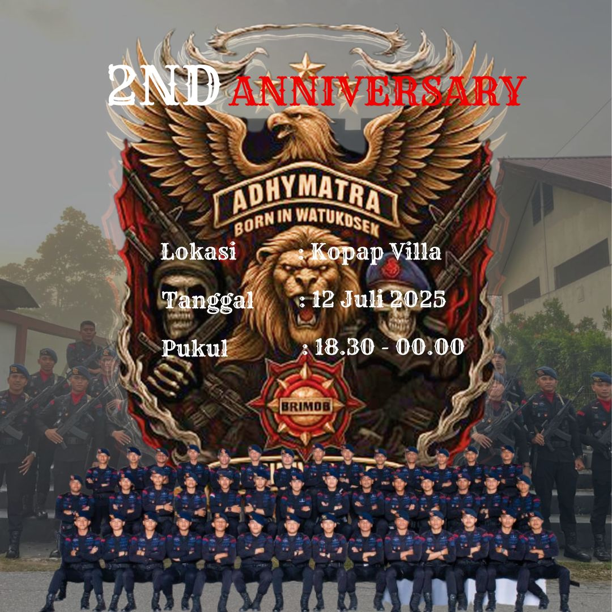

<!DOCTYPE html>
<html lang="id">
<head>
  <meta charset="UTF-8" />
  <meta name="viewport" content="width=device-width, initial-scale=1.0" />
  <title>2nd Anniversary Adhymatra Sultra</title>

  <link href="https://fonts.googleapis.com/css2?family=Anton&display=swap" rel="stylesheet" />

  
</head>
<body>

  <!-- Intro -->
  

    

      A
      D
      H
      Y
      M
      A
      T
      R
      A
      &nbsp;
      S
      U
      L
      T
      R
      A
    

    

      
27

      
49

      
50

    

  

  <!-- Gambar Undangan -->
  

    
  

</body>
</html>
